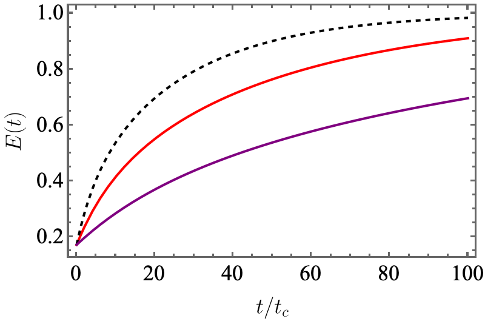
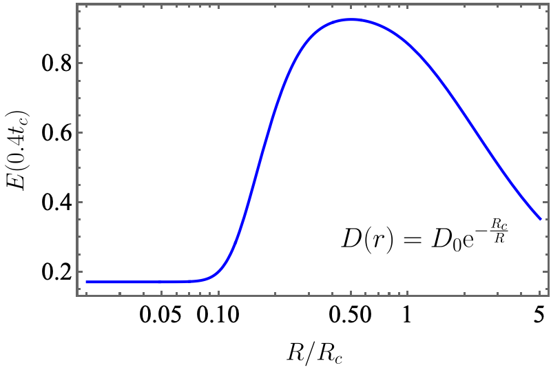

### 1. 模型构建
两类输运过程本质上源于两个基本物理方程，即
-  连续性方程  对于颗粒内部的溶质，浸取物的质量不会凭空消失，从而有
$$ \frac{\partial \phi}{\partial t}+\nabla\cdot \vec{J}=0.    \tag{1} $$
其中，$\phi=\phi(\vec{r}, t)$为溶液中的溶质浓度，$\vec{J}$为溶质扩散的通量，也就是单位面积流出的质量。
-  Fick第一定律 [🔗](https://zh.wikipedia.org/zh-cn/%E8%8F%B2%E5%85%8B%E5%AE%9A%E5%BE%8B)  如果通$\vec{J}$由溶液的浓度梯度决定，那么有
$$ \vec{J}=-D\nabla\phi.  \tag{2}$$
其中$D$为扩散系数，量纲为Mass$^2/$Time。

由这两条方程可以得到扩散方程，也就是Fick第二定律
$$ \frac{\partial \phi}{\partial t}=D\nabla^2\phi,   \tag{3a}$$
原则上这个方程应该做球谐展开然后求解。作为演示，我们首先假设1+1维球对称情况。此时，茶叶和咖啡都被假设为半径为$R$的小球。扩散方程变为
$$ \frac{\partial\phi}{\partial t}=D\left(\frac{\partial^2\phi}{\partial r^2}+\frac{2}{r}\frac{\partial \phi}{\partial r}\right).  \tag{3b}$$

### 2 边界条件
假设$t=0$时，咖啡与茶叶内部的溶液浓度为$\phi_0$。值得特别关注的边界条件位于表面$r=R$处。对于浸泡茶和冲泡咖啡而言，两类问题的边界条件是不一样的。对于手冲、咖啡机这样的冲淋（shower, sh）系统，系统是开放的。我们假定水流可以快速从咖啡粉表面带走溶质，使得
$$ \phi_{\rm sh}(R)=\phi_R\sim 0.  \tag{4a}$$
这是第一类边界条件（Dirichlet BC）。然而，对于浸泡（steep, st）过程，表面会存在浓度堆积，并且由于整个系统是封闭的，表面浓度应该与外界浓度$\phi_{\infty}$相关，不妨假设为
$$ \phi_{\rm st}(R)\propto \phi_{\infty}(t).  \tag{4b}$$
这是第三类边界条件（Robin BC）。用一个统一的边界条件进行描述，可以利用下面的连续性边界条件：在表面处，内部流出的通量等于表面水流带走的通量，有
$$ -D\left.\frac{\partial \phi}{\partial r}\right|_{r=R}=h[\phi(R,t)-\phi_{\infty}(t)]. \tag{5}$$
其中$h$是比例系数。对于冲淋极限，$h\to \infty$，表示表面水流可以尽量带走溶质，并迫使$\phi(R,t) = \phi_{\infty }(t)$。对于浸泡极限，$h$较小，并且$\phi_{\infty}(t)$随着时间演化。

### 3. 方程的求解
扩散方程(3b)可以在频域求解，并退化为ODE。对时间做Laplace变换
$$ L\{\phi(r, t)\}=\Phi(r,s), \tag{6}$$
其中$s$为**复频率**。扩散方程变为
$$ s\Phi-\phi_0=D\left(\frac{d^2\Phi}{dr^2}+\frac{2}{r}\frac{d\Phi}{dr}\right).  \tag{7}$$
这个方程可以解析求解，得到通解
$$ \Phi(r,s)=\frac{\phi_0}{s}+\frac{1}{r}\left(C_1 e^{-kr}+C_2 e^{kr}\right), \; k\equiv \sqrt{s/D}. \tag{8}$$
由于在$r=0$处，浓度必定不能发散，必然有$C_1=-C_2$，此时可见浓度转换为
$$ \Phi(r,s)=\frac{\phi_0}{s}+\frac{C\cdot\sinh(kr)}{r}.  \tag{9}$$
将边界条件(5)带入，定义系统的[毕奥数](https://en.wikipedia.org/wiki/Biot_number) $\mathrm{Bi}=hR/D$，不难解得
$$ C=\frac{\mathrm{Bi}\cdot R(\Phi_\infty(s)-\phi_0/s)}{kR\cosh(kR)+(\mathrm{Bi}-1)\sinh(kR)}. \tag{10}$$
这样就得到了溶液浓度在频域的表达式。

### 4. 提取率：冲淋模型
相比复杂的时间积分，在频域对表面通量积分得到提取的溶剂总质量要简单很多。由Fick定律(2)，表面$r=R$处流出的通量可以表示为
$$ \bar{J}(R,s)=-D\left.\frac{d\Phi(r,s)}{dr}\right|_{r=R}   \tag{11}$$
对于球对称的情况，假设$t=0$时未提取任何质量，离开颗粒的总质量流量在频域中表示为
$$ s\bar{M}_{\rm ex}(s)=4\pi R^2\bar{J}(R,s)     \tag{12}$$
其中，有一个隐藏的复杂性：(10)中的外部溶解度$\Phi_{\infty}(s)$实际上由$\bar{M}_{\rm ex}(s)$所决定，即有
$$ \Phi_{\infty}(s)=\frac{\bar{M}_{\rm ex}(s)}{V_{\rm w}}  \tag{13}$$
其中，$V_{\rm w}$是溶剂（水）的总体积。让我们首先考虑冲淋的极限：$h\to \infty, \Phi_{\infty}=0$，此时，系数$C$被简化为
$$ C=-\frac{R\phi_0}{s\sinh(kR)}.  \tag{14}$$
将其带入(9)、(11)、(12)，得到已提取的质量为
$$ \bar{M}_{\rm ex}(s)=\frac{4\pi R^2 D \phi_0}{s^2}\left[k\coth(kR)-\frac{1}{R}\right].   \tag{15}$$
利用总质量$\bar{M}_{\rm total}=4/3\pi R^3\phi_0$，得到无量纲浸出率
$$\bar{E}(s)\equiv \frac{\bar{M}_{\rm ex}}{\bar{M}_{\rm total}}=\frac{3}{R s}\sqrt{\frac{D}{s}}\coth\left(R\sqrt{\frac{s}{D}}\right)-\frac{3D}{s^2R^2}.   \tag{16}$$
将其变回时域，逆Laplace变换的结果等于函数在复平面内所有极点留数的和。其中，第二部分在$s=0$的地方有一个二阶极点，第一部分在$\sinh(R\sqrt{s/D})=0$或者$s_n=-n^2\pi^2D/R^2, n=1,2,\cdots$处有无穷多个一阶极点。注意到，$s_n$处的留数有
$$ \begin{align*}
\mathrm{Res}(f,s_n)&=\left.\frac{3\sqrt{D}}{R} \frac{\cosh(R\sqrt{s/D})}{(s^{3/2}\sinh(R\sqrt{s/D}))'}\right|_{s=s_n}\\
&=-\frac{6}{n^2\pi^2}.
\end{align*}   \tag{17}
$$
因此，时域的无量纲浸出率可以表示为
$$
\begin{align*}
E(t)&=\mathrm{Res}(s=0)e^{0\cdot t}+\sum_{n=1}^{\infty}\mathrm{Res}(s_n)\cdot e^{s_n t}\\
&=1 - \frac{6}{\pi^2}\sum_{n=1}^{\infty}\, \frac{1}{n^2}\exp\left(-\frac{n^2\pi^2 D}{R^2}t\right).  
\end{align*}     \tag{18}
$$
这个方程将给出关于冲咖啡的浸出率-时间关系。取领头阶，就得到著名的指数浸出关系，有特征时间$t_c\equiv R^2/(D\pi^2)$。

分析浸出率与各参数的依赖关系，首先，我们注意到，浸出率与时间$t$、扩散系数$D$（依赖于温度、颗粒大小等因素，但是在这里我们认为主要依赖于温度）以及研磨度（表征为咖啡粉半径$R$有关）。实际上，手冲咖啡很难达到$h\to\infty$的极限，这样的极限只能在咖啡机这样高压、高流速的情况下取到。这可以解释为什么咖啡机需要更细的研磨度（小$R$），以及更高的水温（对应更大的$D$）。对于手冲而言，扩散系数$D$当中的$R$依赖将不能忽略。根据Einstein-Stokes理论，有效扩散系数可以定义为
$$ D_{\rm eff}(R)=D_0\cdot \exp\left(-\frac{R_c}{R}\right)   \tag{19}$$
下图在(17)、(18)基础上，分别半定量演示浸出率随时间演化（黑色虚线：颗粒大小适中，红线：颗粒太大；紫线：颗粒太小）以及浸出率与颗粒大小的关系。
{:height="50%" width="50%"}

{:height="50%" width="50%"}

### 5. 提取率：浸泡模型
对于泡茶这类浸泡模型，主要是边界条件发生了改变，其中已经定义了(13)所示液体浓度。进一步定义参数，为，液体-固体体积比
$$ \alpha=\frac{V_\mathrm{w}}{V_\mathrm{p}},  \tag{20}$$
仍然取$h\to \infty$的简化版分析，即，茶叶表面与茶水的浓度相同（对应一个充分搅拌的情况），此时有
$$ \Phi(R,s)=\Phi_{\infty}(s)     \tag{21}$$
将完整的浓度带入，利用类似的方法，提取$\bar{M}_{\rm total}$，得到完整的频域表达式
$$ \bar{E}(s)=\frac{1}{s}\cdot\left[1+\frac{\alpha k^2R^2}{3}\left(\frac{1}{\mathrm{Bi}}+\frac{1}{kR\coth(kR)-1}\right)\right]^{-1} \tag{22}$$
可见提取率由两个阻尼项决定：(1) 由Biot数决定的外部阻力，描述溶质从液体表面跨越液-固边界层的难度。对于充分搅拌的情况，$1/\mathrm{Bi}$消失。(2) 由$kR$决定的内部扩散阻抗，用来描述溶质怎样从内部扩散到表面。容易验证，当浸泡时间达到饱和，即，$t\to\infty$或者$s=0$时，浸出率为
$$ \lim_{s\to 0}s\bar{E}(s)=\frac{1}{1+\alpha},     \tag{23}$$
对应了热力学平衡值。

类似地，为了找到提取率的时域表达式，需要找到极点。令$kR=iq$，其中$i$为虚数单位，分母为零的条件为
$$ (1-q\cot q)\left(\frac{1}{\mathrm{Bi}}+\frac{3}{\alpha q^2}\right)=1, \tag{24a} $$
或者
$$ \tan q=\frac{q(3\mathrm{Bi}+\alpha q^2)}{\alpha q^2(1-\mathrm{Bi})+3\mathrm{Bi}}  . \tag{24b}$$
该方程的正根序列定义为$q_n$。同样地，计算各点处的留数，有
$$ E(t)=\frac{\alpha}{1+\alpha}\left[1-\sum_{n=1}^{\infty}\,\frac{6\alpha(\alpha+1)\mathrm{Bi}^2}{q_n^2[\alpha^2q_n^2+\alpha(9\mathrm{Bi}-q_n^2)+9\mathrm{Bi}(\mathrm{Bi}-1)]}\exp\left[-q_n^2\frac{D(R) t}{R^2}\right]\right]  \tag{25}$$

这个提取率可以在$\mathrm{Bi}=0, \infty$两个极限下面展开。对于后者，在$\alpha\to\infty$的极限下，提取率回到(18)。更有趣的是$\mathrm{Bi}\to 0$的情况：搅拌非常弱的情况。此时，特征方程为
$$ \tan q\approx q+\frac{q^3}{3}\approx\frac{q\cdot \alpha q^2}{3\mathrm{Bi}+\alpha q^2} .  \tag{26}$$
解得
$$ q\approx \sqrt{3\mathrm{Bi}\frac{\alpha+1}{\alpha}}.   \tag{27}$$
取级数的第一项，此时有
$$ E(t)\approx \frac{\alpha}{1+\alpha}\left[1-\exp\left(-\frac{3\mathrm{Bi}(1+\alpha)}{\alpha}\cdot\frac{D(R)t}{R^2}\right)\right].   \tag{28}$$

注意到$\mathrm{Bi}=hR/D(R)$，提取率实际写作
$$  E(t)\approx \frac{\alpha}{1+\alpha}\left[1-\exp\left(-\frac{3h}{R}\cdot\frac{1+\alpha}{\alpha}t\right)\right].   \tag{29} $$
可见，内部传导$D$已经从提取率中消失了，特征时间实际上依赖于表征表面传递的Biot数与颗粒表面积的比值。这样就解释了在不搅拌的情况下，研磨带来的收益更小。